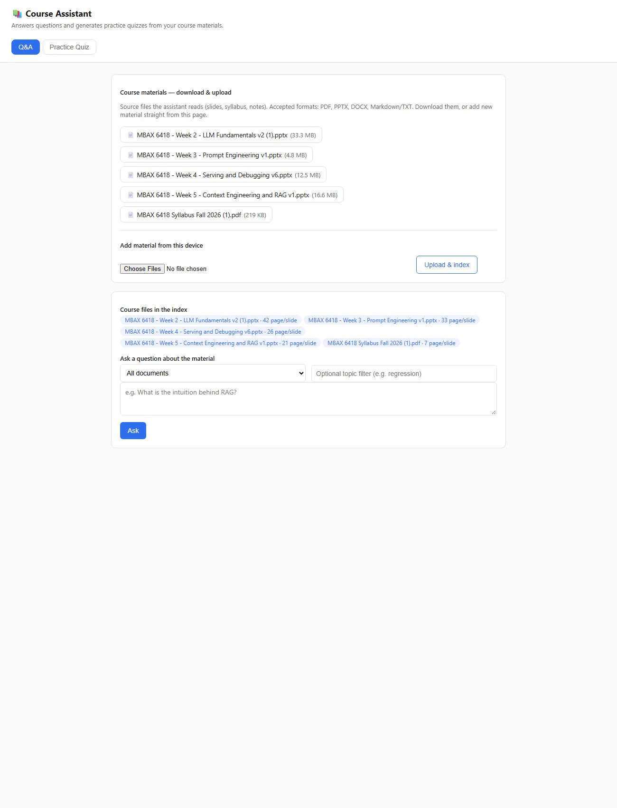
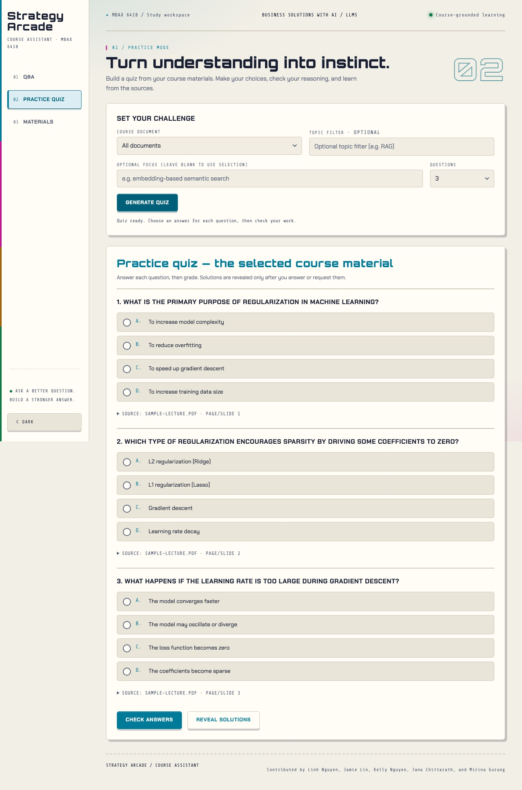
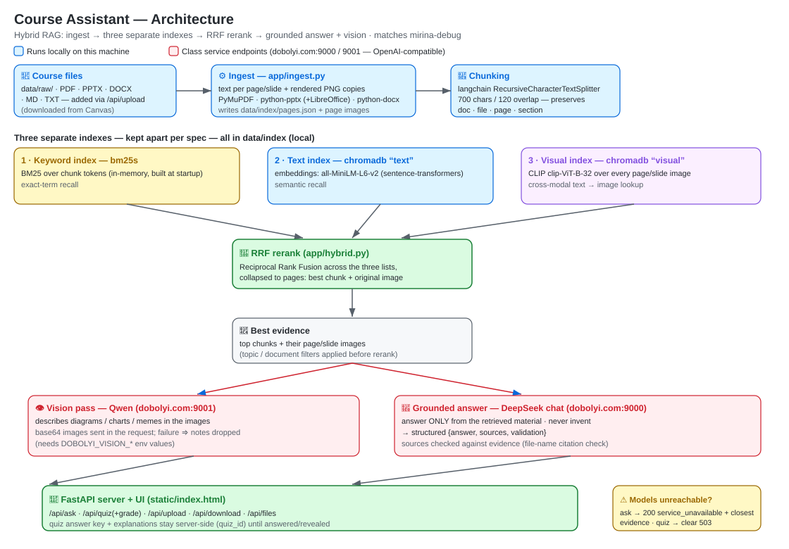

# MBAX 6418 — Assignment 2: Course Assistant

A course assistant that **answers questions** and **generates practice quizzes**
using course materials (slides, syllabus, and other files from Canvas).

**Status:** hybrid-RAG Q&A **and** practice-quiz generator, both live.

## Screenshots

| Q&A (ask + download course materials) | Practice quiz |
|----------------------------------------|---------------|
|  |  |

## What the app accepts
| Format | Text | Page/slide image |
|--------|------|------------------|
| `.pdf` | ✅ | ✅ rendered PNG |
| `.pptx` | ✅ | ✅ rendered PNG (requires LibreOffice) |
| `.docx` | ✅ | ⏳ phase 2 |
| `.md` / `.txt` | ✅ | n/a |

From the dashboard, students can **download the source files**, **upload new
material** (PDF/PPTX/DOCX/MD/TXT), and **remove** documents (removal purges the
document's searchable content — pages, slide images, embeddings — so later
answers don't rely on it). Uploading the same file twice is refused (no
duplicates).

## PowerPoint (.pptx) conversion
Direct upload of `.pptx` decks is supported. Under the hood the app uses
**Python + LibreOffice** to convert each deck to PDF and render every slide to
an image (so answers can show pictures of the actual slides). 

- **Required extra software:** LibreOffice
  (`winget install --id TheDocumentFoundation.LibreOffice -e`, or install from
  libreoffice.org). Without it, `.pptx` text still indexes but slide *images*
  are not produced.
- **How conversion works:** upload → LibreOffice `--convert-to pdf` → each PDF
  page rendered as a PNG at dpi 120 → image stored alongside the slide text.
- **Manual workaround:** exporting a deck to PDF yourself (PowerPoint: File →
  Export → PDF) and uploading the PDF works equally well and needs no extra
  software.
- **Verify converted slides look correct:** after uploading, find the deck in
  the file list, ask the assistant a question about it, and confirm the slide
  image shown in the sources matches the deck's slide (title text, diagrams,
  and layout intact). Slide images are also listed under
  `data/index/pages/` (files named `<deck>_sNNN.png` — open a few and eyeball
  them against the original deck).

## Slide-image RAG and visual questions

Q&A combines BM25 keyword retrieval, text embeddings, and CLIP slide-image
embeddings. Retrieved source images are rendered copies of the original slides,
not AI-generated illustrations. The answer appears next to a gallery with the
**document filename and Slide N / Page N**, full-size image links, and an
**Explain this slide** action. On smaller screens the gallery stacks below the answer.

Select a course document and try:
- “Explain the diagram showing keyword search, vector search, and reranking.”
- “Explain the two charts on slide 7.”
- “Describe the picture on slide 33 and explain its message.”

A singular slide/page number constrains retrieval within the selected document.
Ambiguous ranges or multiple slide references retain the ordinary hybrid ranking.
The vision model analyzes up to three available retrieved images in parallel,
with the question and exact source label supplied separately for each image.
Its attributed observations are passed to the answer model as course evidence,
including information missing from extracted text. For retrieved PowerPoint slides,
the vision pass uses up to three native-resolution embedded pictures from
that exact slide, cropped to the visible picture area; tiny logos are omitted.
These replace their downsized duplicates during image analysis to preserve small
chart labels. Slides without usable raster details use the full-slide render;
the displayed evidence remains the actual full slide in either case.
Failed image analysis or missing renders produce explicit limitations instead of
unsupported visual claims. Internal reasoning and truncated model completions
are never presented as finished answers.
The API returns `vision_sources` and `visual_warnings` alongside `answer`,
`sources` (with `kind`, `label`, and an existing image URL), and `vision_notes`.

**PPTX rendering is required for visual questions:**
```bash
# macOS
brew install --cask libreoffice
# After installing it, rebuild any previously text-only slide index:
python -m scripts.ingest
```
PowerPoint conversion uses a separate headless LibreOffice profile, includes
hidden slides to preserve original numbering, and checks the rendered slide count.
PDF exports can also be uploaded when LibreOffice is unavailable. Original content
and generated indexes remain local and gitignored.

### Regression tests
```bash
# Development dependency only; the app does not require Playwright at runtime.
pip install playwright
python -m playwright install chromium
# Start the local app on port 8000 before running browser tests.
python -m unittest discover -s tests -v
```
The visual-answer and retrieval unit tests isolate external model boundaries.
Live checks must additionally confirm that actual PNGs load and that model
explanations match the retrieved course slides.

## Test question set
A graded set of 5–10 questions (syllabus, slide text, **visual questions
including the meme slide**, and one intentionally unanswerable question) lives
in [docs/EVALUATION.md](docs/EVALUATION.md), with a runner script:
```bash
python scripts/eval_questions.py   # runs each question against the local app
```

## Setup
```bash
python -m venv .venv
# Windows: .venv\Scripts\activate   |  macOS/Linux: source .venv/bin/activate
pip install -r requirements.txt

# Optional but recommended: PPTX slides render as images only if LibreOffice is
# installed (winget install --id TheDocumentFoundation.LibreOffice -e).
```

## Run
```bash
# 1. Put your course files in data/raw/ (PDFs, slides, syllabus, notes)
# 2. Build the index:
python -m scripts.ingest
# 3. Start the app:
python -m uvicorn app.main:app --reload --port 8000
# 4. Open http://localhost:8000
```

## Quick start (real materials)
```bash
# 1. Put course files in data/raw/ (or upload them from the dashboard once running)
python -m scripts.ingest          # ingest + build the hybrid index
python -m uvicorn app.main:app --port 8000
# open http://localhost:8000 — Q&A, quizzes, download/upload
```

## Architecture



**Hybrid RAG** over the course materials:

```
course files → ingest (text + rendered page/slide image per page)
            → chunk pages (text splitter) preserving doc·page·section
            → three separate indexes in chromadb + bm25s:
                keyword (BM25)  ·  text embeddings (all-MiniLM)  ·  visual (CLIP images)
query → run all three → weighted score fusion (rerank)
     → top text chunks + their page images as evidence
     → grounded answer (DeepSeek) + vision pass (Qwen) over relevant images
     → {answer, sources, validation} — sources validated against evidence
```

- **Chunking:** `langchain-text-splitters` (`RecursiveCharacterTextSplitter`), each chunk tagged with doc/file/page/section (deterministic ids so uploads/removals update incrementally).
- **Keyword:** `bm25s`; **text vectors:** `chromadb` collection with all-MiniLM; **visual vectors:** `chromadb` collection with CLIP `clip-ViT-B-32` over every page image, queried cross-modally by the text question.
- **Combine/rerank:** weighted score fusion — per-stage min-max normalization of BM25, text-cosine, and visual-cosine scores, summed with weights (visual boosts surfaced pages for text questions; visual leads when the question is explicitly about an image/diagram/meme).
- **Add/remove:** the dashboard supports upload (incremental indexing) and removal (purges the document's pages, chunks, embeddings, and images); duplicate uploads are refused.
- **Validation:** after generation, citations are checked against the retrieved evidence; the response carries separate `answer` and `sources` fields plus `validation.all_sources_supported`.

## Notes
* Course material and the generated index are **gitignored** (public repo;
  Canvas content may be copyrighted). Run ingest locally.
* Model endpoints are OpenAI-compatible and configured via environment
  variables. Copy `.env.example` to `.env`, fill in the real values the team
  provides, and never commit `.env`. Without these variables the app starts
  but model calls (ask/quiz) fail — see Setup.

## Tests
```bash
pip install -r requirements-dev.txt   # pytest + httpx (test-only deps)
pytest -q                              # fast, offline unit + API tests
python scripts/scan_secrets.py         # fail if a real key/endpoint leaks
```
`tests/test_remove_document_e2e.py` is expected to fail (xfail) until the
remove-document feature from requirement 1a is implemented.

## Evaluation (H1–H3)

Question set (8: 5 text · 2 visual incl. the meme · 1 unanswerable) in
`docs/evaluation/questions.json`; results + interpretation in
`docs/results/evaluation.md`. Re-run with

```bash
python scripts/eval_retrieval.py
```

**Interpretation of the current run:** on the 3-page sample deck all
approaches tie (identical top-1 hits, precision@3 capped at 1/3) — the sample
is too small to separate keyword / vector / hybrid (RRF). The harness is the
deliverable: rerun it on the real course deck, then fill the
answer-correctness + source-support columns (they need `.env` + human
judgment) and update this section. Hybrid adds ~100 ms/query warm (plus a
one-time CLIP load) for the visual evidence it provides.

## Tested vs Unchecked (as of the debug branch)

**Tested ✅**
- Remove + re-add documents through the app, end-to-end: upload → delete by
  doc slug → gone from `/api/files` and `/api/materials` → 404 on re-delete
  (`tests/test_remove_document_e2e.py`, full model stack)
- Security config: no committed keys/endpoints; env-only resolution with dummy
  examples (`tests/test_config_secrets.py`)
- Quiz answer key + explanations never sent to the client; grading + reveal
  (`tests/test_quiz_key_hiding.py`)
- Source validation behaviour pinned (`tests/test_validate_sources.py`)
- Unavailable model services: ask degrades gracefully with evidence
  (`service_unavailable`), quiz returns a clear 503 instead of a misleading 404
  (`tests/test_unavailable_services.py`)
- Secrets-leak scan over all tracked files (`python scripts/scan_secrets.py`)
- Offline suite on the light test deps: `pytest -q` → 12 passed, 1 skipped
  (the remove-doc e2e needs the full stack; runs green there too)

**Unchecked / blocked ⚠️** (see `docs/MANUAL_QA.md` for the full checklist)
- Remove-document **UI button** click-through — API path is verified
  end-to-end; the in-browser flow is a manual QA item.
- Manual QA on real materials: the "Vibe Coding on Prod" meme test (needs the
  actual Week 2 slides), source-vs-original-slide checks.
- Full end-to-end run against the class model endpoints (ask/quiz with real
  chat + vision services) — the automated suite is offline/stubbed by design.
- Dedup is by filename slug only, not content hash (rename ⇒ duplicate).
- Dark mode — not implemented (requirement is conditional: "if available").
- Screenshot content never visually verified against the running app.
- Evaluation: question set + hybrid vs keyword vs vector comparison harness
  with recorded timings are done (docs/evaluation/questions.json,
  scripts/eval_retrieval.py, docs/results/evaluation.md); the
  answer-correctness and source-support columns still need `.env` endpoints +
  human judgment, and a real-deck run for meaningful numbers. The SVG
  architecture diagram is done (docs/architecture.svg, embedded above).
